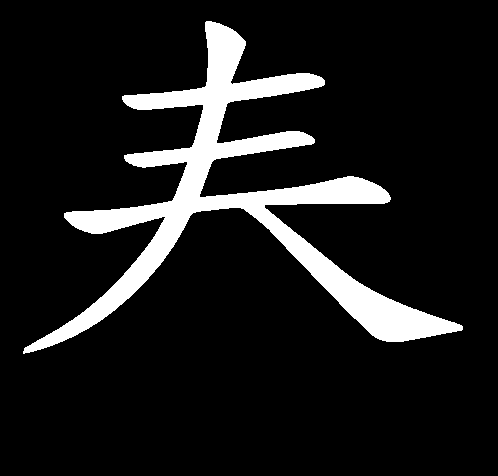
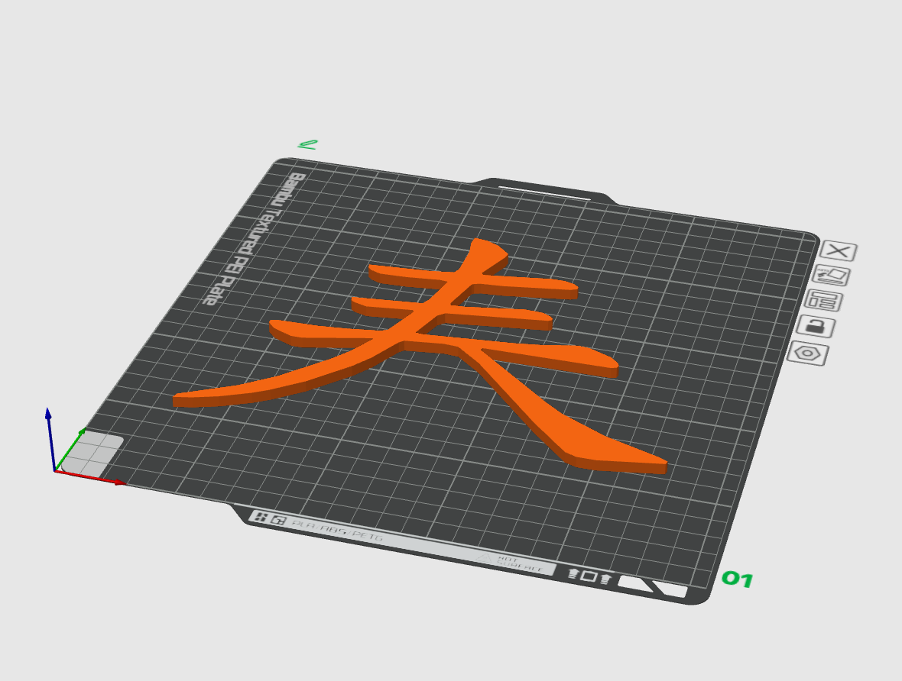
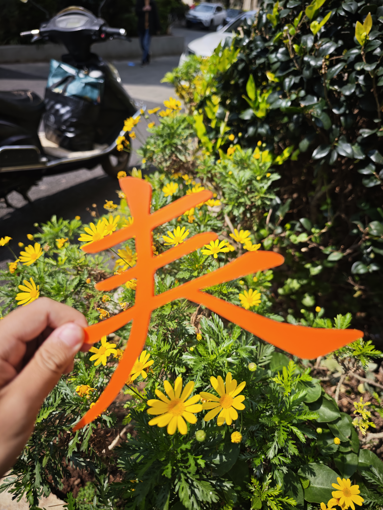

## abstract
一个简单的开源图案生成器,例如下图,将汉字生成能够3d打印的实体.

<table>
  <tr>
    <td align="center"><br/>二值化图案</td>
    <td align="center"><br/>3D打印预览</td>
    <td align="center"><br/>实物</td>
  </tr>
</table>

## installation
假设你已经安装了python:
```bash
conda create -n myenv python=3.11
conda activate myenv
pip install -r requirements.txt
```
## usage
```bash
python main.py
```
## license
MIT License

## TODO
- 检测并分离多个实体
- 支持gui界面